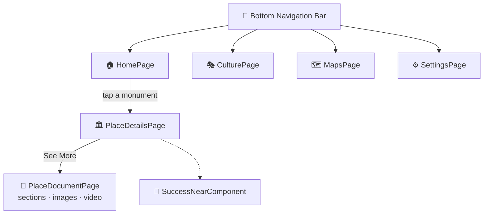

<div align="center">

# 🏛️ Sufes

**A mobile guide to the Roman heritage of Sbiba (ancient *Sufes*), Tunisia.**

Discover monuments · explore the site map · learn through images, video, and stories


</div>

---

## 📖 Table of Contents

- [Overview](#-overview)
- [Features](#-features)
- [Screens & Navigation](#-screens--navigation)
- [Design](#-design)
- [Tech Stack](#-tech-stack)
- [Project Structure](#-project-structure)
- [Getting Started](#-getting-started)
- [Related Repositories](#-related-repositories)

---

## 🌟 Overview

**Sbiba**, known in Roman times as **Sufes**, is a town in the Kasserine region of Tunisia with remains such as the **Nymphaeum of El Guennara**, an amphitheatre, and an aqueduct.

**Sufes** is the visitor-facing app that brings these sites to life. Visitors can browse monuments and cultural events, explore an illustrated map of the site, and open detail pages with descriptions, photo galleries, and "imagination" videos that show how the monuments may have looked.

The UI was designed in **FlutterFlow** and exported as a standard Flutter project.

---

## ✨ Features

| | Feature | Description |
|---|---|---|
| 🏠 | **Discover** | Home feed with popular monuments and featured experiences such as *Fortin Reconstitution* |
| 🎭 | **Culture & events** | Cultural events such as *Sbiba By Night*, with duration and pricing |
| 🗺️ | **Site map** | Illustrated vector map of Sbiba's monuments |
| 🏛️ | **Monument details** | Description, an immersive header, and quick actions for 360° view and audio |
| 📄 | **Monument document** | Long-form content in sections, an image gallery, and a *Video Imagination* player |
| 🎉 | **Discovery reward** | "Congrats, you found the…" pop-up when a visitor discovers a monument |
| 📱 | **Bottom navigation** | Tabs for Home, Culture, Map, and Settings |

---

## 🧭 Screens & Navigation



| Route | Screen |
|---|---|
| `/homePage` | Home (Discover) |
| `/CulturePage` | Culture & events |
| `/MapsPage` | Site map |
| `/SettingsPage` | Settings |
| `/placeDetailsPage` | Monument details |
| `/PlaceDocumentPage` | Monument document (gallery & video) |

---

## 🎨 Design

The visual identity uses warm, stone-like tones and a classical serif that suit the archaeological theme.

| Token | Color |
|---|---|
| Primary |  `#9B735B` |
| Primary text |  `#5A2C2F` |
| Background |  `#EBDFDD` |
| Secondary |  `#39D2C0` |

**Typography:** *Plantin MT Pro* for headings and display text (bundled in `assets/fonts`) and *Inter* for body text.

---

## 🛠 Tech Stack

| Purpose | Package |
|---|---|
| UI framework | Flutter (Dart `>=3.0.0 <4.0.0`), generated with FlutterFlow |
| Routing | `go_router` |
| State | `provider` |
| Media | `video_player`, `chewie`, `cached_network_image`, `flutter_svg` |
| UI and animations | `flutter_animate`, `carousel_slider`, `expandable`, `auto_size_text`, `google_fonts`, `font_awesome_flutter` |
| Storage | `shared_preferences`, `sqflite`, `path_provider` |
| Utilities | `intl`, `url_launcher`, `timeago` |

---

## 📂 Project Structure

```
lib/
├── main.dart                     # App entry, theme & bottom navigation bar
├── index.dart                    # Page exports
├── flutter_flow/                 # FlutterFlow runtime (theme, widgets, nav, utils)
│   └── nav/nav.dart              # go_router route definitions
├── pages/
│   ├── home_page/                # Discover feed
│   ├── culture_page/             # Cultural events
│   ├── maps_page/                # Site map
│   └── settings_page/            # Settings
└── user/
    ├── place_details_page/       # Monument details
    ├── place_document_page/      # Sections, gallery & video
    └── component/
        └── success_near_component/  # "You found it!" pop-up
assets/
├── fonts/                        # Plantin MT Pro
└── images/                       # Illustrations, map (mps.svg)
```

---

## 🚀 Getting Started

### Prerequisites

- [Flutter SDK](https://docs.flutter.dev/get-started/install) on the **stable** channel
- An Android or iOS emulator, a device, or Chrome

### 1. Clone

```bash
git clone https://github.com/achreflajmi/Sufes-Front.git
cd Sufes-Front
```

> **Windows users:** some asset filenames are long. If checkout fails with `Filename too long`, run
> `git config --global core.longpaths true` and clone again.

### 2. Install dependencies

```bash
flutter pub get
```

### 3. Run

```bash
flutter run              # pick a connected device
flutter run -d chrome    # run in the browser
```

---

## 🔗 Related Repositories

| Repo | Description |
|---|---|
| [SbibaBack](https://github.com/achreflajmi/SbibaBack) | AI backend: virtual guide, monument and rock analysis, restoration advice, quizzes |
| **Sufes-Front** | This repository: the visitor mobile app |

---

<div align="center">

Made with ❤️ to preserve and share the heritage of Sbiba.

</div>
